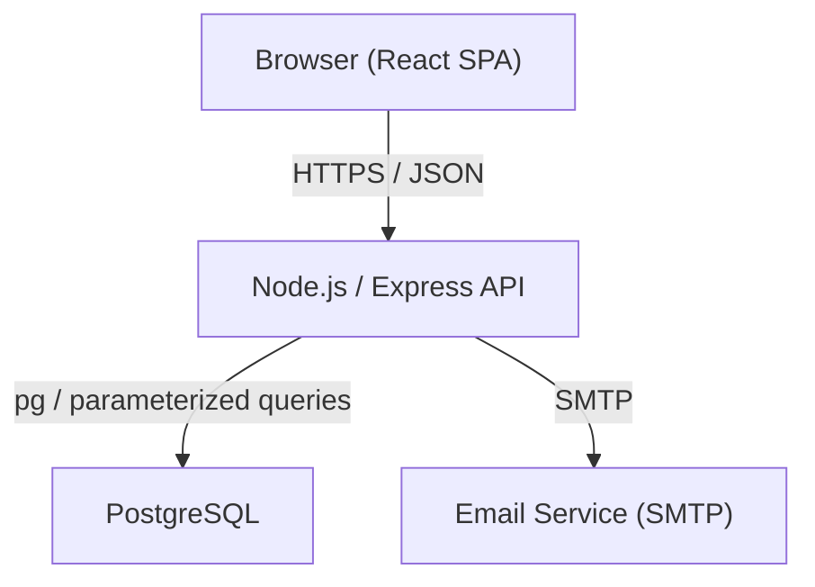
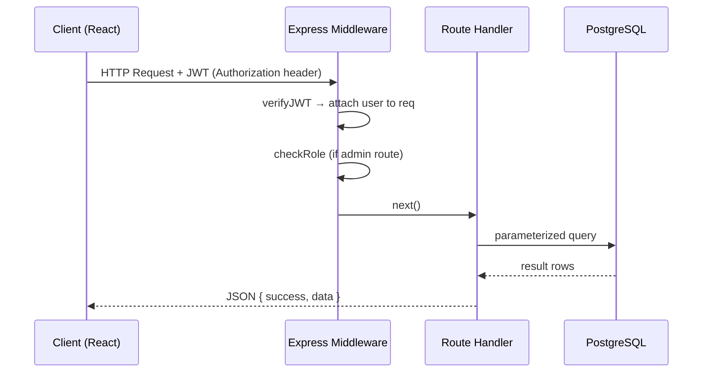

# Design Document: E-Commerce Web Application

## Overview

A full-stack e-commerce platform supporting two roles — Customer and Admin — covering the complete shopping lifecycle from product discovery to order fulfillment. The frontend is a React SPA, the backend is a RESTful Node.js/Express API, and the database is PostgreSQL.

Key goals:
- Stateless JWT-based authentication with role-based access control
- Clean separation between customer-facing and admin-facing API surfaces
- Responsive UI from 320px to 1920px using Tailwind CSS
- Secure-by-default: parameterized queries, bcrypt hashing, CORS, rate limiting, env-based secrets

---

## Architecture

The system follows a standard three-tier architecture.



### Request Flow



### Frontend Routing Structure

```
/                        → Homepage (featured products)
/products                → Product catalog (search, filter, sort)
/products/:id            → Product detail
/cart                    → Shopping cart
/wishlist                → Wishlist
/checkout                → Checkout flow
/orders                  → Order history
/orders/:id              → Order detail / tracking
/profile                 → User profile & addresses
/login                   → Login
/register                → Registration
/forgot-password         → Forgot password
/reset-password/:token   → Password reset

/admin                   → Admin dashboard
/admin/products          → Product management
/admin/categories        → Category management
/admin/orders            → Order management
/admin/users             → User management
/admin/coupons           → Coupon management
```

---

## Components and Interfaces

### Backend Services

#### Auth Service
| Endpoint | Method | Auth | Description |
|---|---|---|---|
| `/api/auth/register` | POST | None | Register new customer |
| `/api/auth/login` | POST | None | Login, returns JWT |
| `/api/auth/logout` | POST | JWT | Client-side JWT removal |
| `/api/auth/forgot-password` | POST | None | Send reset email |
| `/api/auth/reset-password/:token` | POST | None | Reset password with token |

#### Product Service
| Endpoint | Method | Auth | Description |
|---|---|---|---|
| `/api/products` | GET | Optional | Paginated catalog (search, filter, sort) |
| `/api/products/:id` | GET | Optional | Product detail |
| `/api/products` | POST | Admin | Create product |
| `/api/products/:id` | PUT | Admin | Update product |
| `/api/products/:id` | DELETE | Admin | Delete product |

#### Category Service
| Endpoint | Method | Auth | Description |
|---|---|---|---|
| `/api/categories` | GET | None | List all categories |
| `/api/categories` | POST | Admin | Create category |
| `/api/categories/:id` | PUT | Admin | Update category |
| `/api/categories/:id` | DELETE | Admin | Delete category |

#### Cart Service
| Endpoint | Method | Auth | Description |
|---|---|---|---|
| `/api/cart` | GET | Customer | Get cart with totals |
| `/api/cart` | POST | Customer | Add item to cart |
| `/api/cart/:itemId` | PUT | Customer | Update item quantity |
| `/api/cart/:itemId` | DELETE | Customer | Remove item |

#### Wishlist Service
| Endpoint | Method | Auth | Description |
|---|---|---|---|
| `/api/wishlist` | GET | Customer | Get wishlist |
| `/api/wishlist` | POST | Customer | Add product |
| `/api/wishlist/:productId` | DELETE | Customer | Remove product |

#### Order Service
| Endpoint | Method | Auth | Description |
|---|---|---|---|
| `/api/orders` | GET | Customer | Order history (paginated) |
| `/api/orders/:id` | GET | Customer | Order detail |
| `/api/orders` | POST | Customer | Create order (checkout) |

#### User / Profile Service
| Endpoint | Method | Auth | Description |
|---|---|---|---|
| `/api/profile` | GET | Customer | Get profile |
| `/api/profile` | PUT | Customer | Update profile |
| `/api/profile/addresses` | GET | Customer | List addresses |
| `/api/profile/addresses` | POST | Customer | Add address |
| `/api/profile/addresses/:id` | PUT | Customer | Update address |
| `/api/profile/addresses/:id` | DELETE | Customer | Delete address |

#### Admin Service
| Endpoint | Method | Auth | Description |
|---|---|---|---|
| `/api/admin/dashboard` | GET | Admin | Stats + 30-day revenue |
| `/api/admin/orders` | GET | Admin | All orders (paginated, filterable) |
| `/api/admin/orders/:id` | PUT | Admin | Update order status |
| `/api/admin/users` | GET | Admin | All users (paginated) |
| `/api/admin/users/:id` | PUT | Admin | Update role / deactivate |
| `/api/admin/coupons` | GET | Admin | List coupons |
| `/api/admin/coupons` | POST | Admin | Create coupon |
| `/api/admin/coupons/:id` | DELETE | Admin | Delete coupon |

### Middleware Stack

```
express.json()
cors({ origin: process.env.FRONTEND_ORIGIN })
helmet()
rateLimiter (auth endpoints: 100 req / 15 min / IP)
verifyJWT (protected routes)
requireRole('admin') (admin routes)
validateBody(schema) (per-route Joi/Zod schema)
errorHandler (global)
```

### Frontend Components

```
src/
  components/
    Navbar.jsx
    Footer.jsx
    ProductCard.jsx
    CartItem.jsx
    OrderStatusBadge.jsx
    Pagination.jsx
    Toast.jsx            ← global toast provider
    LoadingSpinner.jsx
    EmptyState.jsx
  pages/
    HomePage.jsx
    ProductsPage.jsx
    ProductDetailPage.jsx
    CartPage.jsx
    WishlistPage.jsx
    CheckoutPage.jsx
    OrderHistoryPage.jsx
    OrderDetailPage.jsx
    ProfilePage.jsx
    LoginPage.jsx
    RegisterPage.jsx
    ForgotPasswordPage.jsx
    ResetPasswordPage.jsx
    admin/
      DashboardPage.jsx
      ProductsPage.jsx
      CategoriesPage.jsx
      OrdersPage.jsx
      UsersPage.jsx
      CouponsPage.jsx
  hooks/
    useAuth.js
    useCart.js
    useToast.js
  api/
    axiosInstance.js     ← attaches JWT header, handles 401
    auth.js
    products.js
    cart.js
    wishlist.js
    orders.js
    profile.js
    admin.js
  context/
    AuthContext.jsx
    CartContext.jsx
  router/
    PrivateRoute.jsx     ← redirects unauthenticated users
    AdminRoute.jsx       ← redirects non-admins
```

---

## Data Models

### Database Schema

```sql
-- Users
CREATE TABLE users (
    id          SERIAL PRIMARY KEY,
    name        VARCHAR(255) NOT NULL,
    email       VARCHAR(255) UNIQUE NOT NULL,
    password    VARCHAR(255) NOT NULL,          -- bcrypt hash
    role        VARCHAR(20) NOT NULL DEFAULT 'customer' CHECK (role IN ('customer', 'admin')),
    is_active   BOOLEAN NOT NULL DEFAULT TRUE,
    reset_token VARCHAR(255),
    reset_token_expiry TIMESTAMPTZ,
    created_at  TIMESTAMPTZ NOT NULL DEFAULT NOW(),
    updated_at  TIMESTAMPTZ NOT NULL DEFAULT NOW()
);

-- Categories
CREATE TABLE categories (
    id         SERIAL PRIMARY KEY,
    name       VARCHAR(255) UNIQUE NOT NULL,
    created_at TIMESTAMPTZ NOT NULL DEFAULT NOW()
);

-- Products
CREATE TABLE products (
    id             SERIAL PRIMARY KEY,
    name           VARCHAR(255) NOT NULL,
    description    TEXT,
    category_id    INTEGER REFERENCES categories(id),
    price          NUMERIC(10,2) NOT NULL CHECK (price >= 0),
    discount_price NUMERIC(10,2) CHECK (discount_price >= 0),
    stock          INTEGER NOT NULL DEFAULT 0 CHECK (stock >= 0),
    status         VARCHAR(20) NOT NULL DEFAULT 'active' CHECK (status IN ('active', 'inactive')),
    is_featured    BOOLEAN NOT NULL DEFAULT FALSE,
    created_at     TIMESTAMPTZ NOT NULL DEFAULT NOW(),
    updated_at     TIMESTAMPTZ NOT NULL DEFAULT NOW()
);

-- Product Images
CREATE TABLE product_images (
    id         SERIAL PRIMARY KEY,
    product_id INTEGER NOT NULL REFERENCES products(id) ON DELETE CASCADE,
    url        VARCHAR(1024) NOT NULL,
    is_primary BOOLEAN NOT NULL DEFAULT FALSE,
    sort_order INTEGER NOT NULL DEFAULT 0
);

-- Addresses
CREATE TABLE addresses (
    id          SERIAL PRIMARY KEY,
    user_id     INTEGER NOT NULL REFERENCES users(id) ON DELETE CASCADE,
    street      VARCHAR(512) NOT NULL,
    city        VARCHAR(255) NOT NULL,
    state       VARCHAR(255) NOT NULL,
    postal_code VARCHAR(20) NOT NULL,
    country     VARCHAR(255) NOT NULL,
    is_default  BOOLEAN NOT NULL DEFAULT FALSE,
    created_at  TIMESTAMPTZ NOT NULL DEFAULT NOW()
);

-- Cart
CREATE TABLE cart (
    id         SERIAL PRIMARY KEY,
    user_id    INTEGER NOT NULL REFERENCES users(id) ON DELETE CASCADE,
    product_id INTEGER NOT NULL REFERENCES products(id) ON DELETE CASCADE,
    quantity   INTEGER NOT NULL DEFAULT 1 CHECK (quantity > 0),
    added_at   TIMESTAMPTZ NOT NULL DEFAULT NOW(),
    UNIQUE (user_id, product_id)
);

-- Wishlist
CREATE TABLE wishlist (
    id         SERIAL PRIMARY KEY,
    user_id    INTEGER NOT NULL REFERENCES users(id) ON DELETE CASCADE,
    product_id INTEGER NOT NULL REFERENCES products(id) ON DELETE CASCADE,
    added_at   TIMESTAMPTZ NOT NULL DEFAULT NOW(),
    UNIQUE (user_id, product_id)
);

-- Coupons
CREATE TABLE coupons (
    id             SERIAL PRIMARY KEY,
    code           VARCHAR(100) UNIQUE NOT NULL,
    discount_type  VARCHAR(20) NOT NULL CHECK (discount_type IN ('percentage', 'fixed')),
    discount_value NUMERIC(10,2) NOT NULL CHECK (discount_value > 0),
    expires_at     TIMESTAMPTZ NOT NULL,
    is_active      BOOLEAN NOT NULL DEFAULT TRUE,
    created_at     TIMESTAMPTZ NOT NULL DEFAULT NOW()
);

-- Orders
CREATE TABLE orders (
    id             SERIAL PRIMARY KEY,
    user_id        INTEGER NOT NULL REFERENCES users(id),
    address_id     INTEGER REFERENCES addresses(id),
    status         VARCHAR(20) NOT NULL DEFAULT 'Pending'
                       CHECK (status IN ('Pending','Confirmed','Shipped','Delivered','Cancelled')),
    payment_method VARCHAR(50) NOT NULL DEFAULT 'Cash on Delivery',
    subtotal       NUMERIC(10,2) NOT NULL,
    tax            NUMERIC(10,2) NOT NULL DEFAULT 0,
    discount       NUMERIC(10,2) NOT NULL DEFAULT 0,
    total          NUMERIC(10,2) NOT NULL,
    coupon_id      INTEGER REFERENCES coupons(id),
    created_at     TIMESTAMPTZ NOT NULL DEFAULT NOW(),
    updated_at     TIMESTAMPTZ NOT NULL DEFAULT NOW()
);

-- Order Items
CREATE TABLE order_items (
    id         SERIAL PRIMARY KEY,
    order_id   INTEGER NOT NULL REFERENCES orders(id) ON DELETE CASCADE,
    product_id INTEGER NOT NULL REFERENCES products(id),
    quantity   INTEGER NOT NULL CHECK (quantity > 0),
    unit_price NUMERIC(10,2) NOT NULL,
    subtotal   NUMERIC(10,2) NOT NULL
);

-- Payments
CREATE TABLE payments (
    id             SERIAL PRIMARY KEY,
    order_id       INTEGER NOT NULL REFERENCES orders(id) ON DELETE CASCADE,
    method         VARCHAR(50) NOT NULL,
    status         VARCHAR(20) NOT NULL DEFAULT 'pending'
                       CHECK (status IN ('pending','completed','failed','refunded')),
    amount         NUMERIC(10,2) NOT NULL,
    transaction_id VARCHAR(255),
    created_at     TIMESTAMPTZ NOT NULL DEFAULT NOW()
);

-- Reviews
CREATE TABLE reviews (
    id         SERIAL PRIMARY KEY,
    user_id    INTEGER NOT NULL REFERENCES users(id),
    product_id INTEGER NOT NULL REFERENCES products(id) ON DELETE CASCADE,
    rating     INTEGER NOT NULL CHECK (rating BETWEEN 1 AND 5),
    comment    TEXT,
    created_at TIMESTAMPTZ NOT NULL DEFAULT NOW(),
    UNIQUE (user_id, product_id)
);
```

### API Response Envelope

All API responses use a consistent JSON envelope:

```json
// Success
{ "success": true, "data": { ... } }

// Paginated success
{ "success": true, "data": [...], "pagination": { "page": 1, "pageSize": 20, "total": 150 } }

// Error
{ "success": false, "error": { "message": "...", "fields": [...] } }
```

### JWT Payload

```json
{ "id": 42, "email": "user@example.com", "role": "customer", "iat": 1700000000, "exp": 1700604800 }
```

### Cart Totals Calculation

```
effective_price = discount_price ?? price
subtotal = SUM(effective_price × quantity)  for all cart items
tax      = subtotal × TAX_RATE              (TAX_RATE from env, default 0)
total    = subtotal + tax
```

---

## Correctness Properties

*A property is a characteristic or behavior that should hold true across all valid executions of a system — essentially, a formal statement about what the system should do. Properties serve as the bridge between human-readable specifications and machine-verifiable correctness guarantees.*

### Property 1: Password never exposed in API responses

*For any* registration or login request, the JSON response body must not contain a `password` or `hash` field at any nesting level.

**Validates: Requirements 1.5, 19.3**

---

### Property 2: Registration input validation rejects invalid payloads

*For any* registration request where at least one field is missing, malformed (invalid email format), or the password is fewer than 8 characters, the API must return 400 with a response body that lists the invalid fields.

**Validates: Requirements 1.3, 18.2**

---

### Property 3: Unauthenticated requests are rejected on protected routes

*For any* protected API route, a request sent without an Authorization header (or with an invalid/expired JWT) must receive a 401 Unauthorized response.

**Validates: Requirements 4.1, 4.4**

---

### Property 4: Customer role cannot access admin routes

*For any* admin-only API route and any JWT carrying role "customer", the API must return 403 Forbidden.

**Validates: Requirements 4.2**

---

### Property 5: Product search results always match the query

*For any* search query string Q, every product returned by the search endpoint must have a `name` or `description` that contains Q (case-insensitive). No returned product may fail this predicate.

**Validates: Requirements 6.1**

---

### Property 6: Category filter returns only products in the selected category

*For any* category ID filter applied to the product listing endpoint, every product in the response must belong to the specified category.

**Validates: Requirements 6.2**

---

### Property 7: Price range filter respects effective price

*For any* [min, max] price range filter, every returned product's effective price (discount_price if set, otherwise price) must satisfy min ≤ effective_price ≤ max.

**Validates: Requirements 6.3**

---

### Property 8: Sort order produces correctly ordered results

*For any* sort parameter (`price_asc`, `price_desc`, `newest`), the returned product list must be monotonically ordered by the specified criterion — no adjacent pair of products may violate the ordering.

**Validates: Requirements 6.4**

---

### Property 9: Cart totals are arithmetically correct

*For any* cart state with N items, the API-returned `subtotal` must equal the sum of `effective_price(item) × quantity` for all items, `tax` must equal `subtotal × TAX_RATE`, and `total` must equal `subtotal + tax`.

**Validates: Requirements 7.6**

---

### Property 10: Out-of-stock products cannot be added to cart

*For any* product whose `stock` is 0, a request to add it to the cart must return 400 Bad Request.

**Validates: Requirements 7.2**

---

### Property 11: Wishlist add/remove round-trip

*For any* product, adding it to the wishlist and then removing it must result in the wishlist returning to its original state — the product must no longer appear in the wishlist response.

**Validates: Requirements 8.1, 8.3**

---

### Property 12: Wishlist items contain all required fields

*For any* wishlist, every item in the response must include `name`, `primary_image`, `price`, and `discount_price` (or null).

**Validates: Requirements 8.4**

---

### Property 13: Checkout side effects are atomic

*For any* successful checkout with a non-empty cart, the system must: (a) create an Order with at least one OrderItem, (b) decrement each product's stock by the ordered quantity, and (c) clear the customer's cart — all three must hold after a single checkout request.

**Validates: Requirements 10.1, 10.6, 10.7**

---

### Property 14: Invalid coupon codes are rejected at checkout

*For any* coupon code that is expired, does not exist, or is inactive, applying it at checkout must return 400 Bad Request.

**Validates: Requirements 10.5**

---

### Property 15: Order isolation between customers

*For any* order belonging to customer A, a request by customer B (different user ID) to view that order must return 403 Forbidden.

**Validates: Requirements 11.4**

---

### Property 16: Negative price or stock rejected on product creation/update

*For any* product creation or update payload where `price < 0` or `stock < 0`, the API must return 400 Bad Request.

**Validates: Requirements 12.5**

---

### Property 17: Category deletion blocked when products are assigned

*For any* category that has one or more products assigned to it, a DELETE request must return 409 Conflict.

**Validates: Requirements 13.5**

---

### Property 18: Admin order status filter returns only matching orders

*For any* status filter value applied to the admin order listing endpoint, every order in the response must have exactly that status.

**Validates: Requirements 14.1**

---

### Property 19: Invalid order status values are rejected

*For any* order status update where the submitted value is not one of {Pending, Confirmed, Shipped, Delivered, Cancelled}, the API must return 400 Bad Request.

**Validates: Requirements 14.3**

---

### Property 20: Deactivated user accounts cannot log in

*For any* user account with `is_active = false`, a login attempt with correct credentials must return 403 Forbidden rather than a JWT.

**Validates: Requirements 15.3**

---

### Property 21: Coupon list items contain all required fields

*For any* coupon list response, every coupon object must include `code`, `discount_type`, `discount_value`, `expires_at`, and `is_active`.

**Validates: Requirements 16.4**

---

### Property 22: Dashboard revenue equals sum of Delivered order totals

*For any* set of orders in the database, the `total_revenue` value returned by the dashboard endpoint must equal the arithmetic sum of `total` for all orders with status "Delivered".

**Validates: Requirements 17.1**

---

### Property 23: Validation error responses are structured

*For any* request body that fails schema validation, the 400 response must contain `{ "success": false, "error": { "fields": [...] } }` where `fields` is a non-empty array.

**Validates: Requirements 18.2**

---

### Property 24: All API responses follow the standard envelope

*For any* API endpoint and any outcome (success or error), the response body must be a JSON object containing a boolean `success` field and either a `data` field (on success) or an `error` field (on failure).

**Validates: Requirements 18.3**

---

## Error Handling

### HTTP Status Code Conventions

| Scenario | Status |
|---|---|
| Successful read/update | 200 |
| Successful creation | 201 |
| Bad request / validation failure | 400 |
| Unauthenticated | 401 |
| Forbidden (insufficient role or resource ownership) | 403 |
| Not found | 404 |
| Conflict (duplicate) | 409 |
| Too many requests | 429 |
| Internal server error | 500 |

### Global Error Handler

All unhandled errors bubble to a single Express error-handling middleware that:
1. Logs the error (never to stdout in production without redaction)
2. Returns the standard JSON envelope with `success: false`
3. Never leaks stack traces to clients in production (`NODE_ENV !== 'development'`)

### Frontend Error Handling

- Axios response interceptor catches all 4xx/5xx responses
- 401 responses redirect to `/login` and clear stored JWT
- 403 responses redirect to `/` with a toast notification
- 400/409/422 responses surface the `error.message` (or field errors) in a toast
- Network errors display a generic "Connection error" toast
- All async operations in React components wrapped in try/catch with loading/error state

### Input Validation Strategy

- Backend: Joi or Zod schemas per route; validation middleware runs before handlers
- All schema errors serialized to the `error.fields` array format
- Frontend: HTML5 validation + React state validation before submitting requests (defense in depth, not sole validation layer)

---

## Testing Strategy

### Dual Testing Approach

Both unit tests and property-based tests are required. They are complementary:
- Unit tests verify specific examples, integration points, and edge cases
- Property-based tests verify universal invariants across randomly generated inputs

### Property-Based Testing

**Library selection:**
- Backend (Node.js): `fast-check`
- Frontend (React): `fast-check` with React Testing Library

**Configuration:**
- Minimum 100 iterations per property test
- Each property test must reference its design property in a tag comment

**Tag format:**
```
// Feature: ecommerce-web-app, Property N: <property_text>
```

**Each correctness property (P1–P24) must be implemented by exactly one property-based test.**

Example property test (Property 9 — cart totals):
```typescript
// Feature: ecommerce-web-app, Property 9: Cart totals are arithmetically correct
it('cart totals are arithmetically correct', () => {
  fc.assert(
    fc.property(
      fc.array(fc.record({
        price: fc.float({ min: 0.01, max: 9999 }),
        discount_price: fc.option(fc.float({ min: 0.01, max: 9999 })),
        quantity: fc.integer({ min: 1, max: 100 }),
      }), { minLength: 1 }),
      (items) => {
        const subtotal = items.reduce((sum, i) => {
          const ep = i.discount_price ?? i.price;
          return sum + ep * i.quantity;
        }, 0);
        const tax = subtotal * TAX_RATE;
        const total = subtotal + tax;
        const result = calculateCartTotals(items);
        expect(result.subtotal).toBeCloseTo(subtotal, 2);
        expect(result.tax).toBeCloseTo(tax, 2);
        expect(result.total).toBeCloseTo(total, 2);
      }
    ),
    { numRuns: 100 }
  );
});
```

### Unit Testing

**Framework:** Jest (backend + frontend) + React Testing Library (frontend components)

Unit tests should cover:
- Specific examples demonstrating correct behavior (login success, registration conflict, etc.)
- Integration points: JWT middleware → route handler → DB query
- Edge cases: empty cart checkout, duplicate wishlist add, deactivated user login
- Error conditions: missing fields, expired tokens, invalid status values

Unit tests should NOT exhaustively cover input ranges — that is the role of property tests.

### Test Organization

```
backend/
  tests/
    unit/
      auth.test.ts
      cart.test.ts
      order.test.ts
      ...
    property/
      auth.property.test.ts     ← P1, P2, P3, P4, P5
      products.property.test.ts ← P5, P6, P7, P8, P16, P17
      cart.property.test.ts     ← P9, P10
      wishlist.property.test.ts ← P11, P12
      checkout.property.test.ts ← P13, P14
      orders.property.test.ts   ← P15, P18, P19
      admin.property.test.ts    ← P18, P19, P20, P21, P22
      api.property.test.ts      ← P23, P24

frontend/
  src/
    __tests__/
      components/
        Cart.test.tsx
        ProductCard.test.tsx
        ...
      pages/
        LoginPage.test.tsx
        CheckoutPage.test.tsx
        ...
```

### Coverage Targets

- Backend unit + property tests: ≥ 80% line coverage
- All 24 correctness properties implemented as property-based tests
- All acceptance criteria classified as "example" covered by at least one unit test
